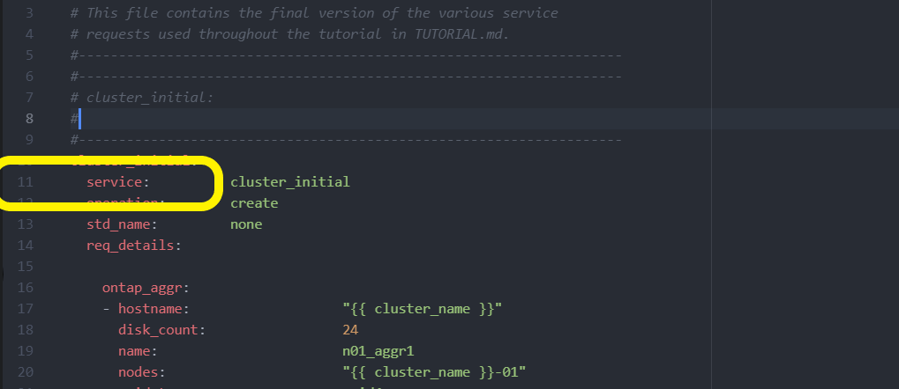

= Ponga en marcha el clúster de ONTAP utilizando la solución
:hardbreaks:
:allow-uri-read: 
:nofooter: 
:icons: font
:linkattrs: 
:imagesdir: ../media/

[role="lead"]
Después de completar la preparación y la planificación, estará listo para utilizar la solución ONTAP day 0/1 para configurar rápidamente un clúster ONTAP con Ansible.

En cualquier momento durante los pasos de esta sección, puede elegir probar una solicitud en lugar de ejecutarla realmente. Para probar una solicitud, cambie la `site.yml` tableta playbook en la línea de comandos a `logic.yml`.

NOTE:  `docs/tutorial-requests.txt`La ubicación contiene la versión final de todas las solicitudes de servicio utilizadas en este procedimiento. Si tiene dificultades para ejecutar una solicitud de servicio, puede copiar la solicitud pertinente del `tutorial-requests.txt` archivo a la `playbooks/inventory/group_vars/all/tutorial-requests.yml` ubicación y modificar los valores codificados según sea necesario (dirección IP, nombres agregados, etc.). A continuación, debería poder ejecutar correctamente la solicitud.

== Antes de empezar

* Debe tener Ansible instalado.
* Debe haber descargado la solución ONTAP day 0/1 y extraído la carpeta a la ubicación deseada en el nodo de control de Ansible.
* El estado del sistema ONTAP debe cumplir con los requisitos y debe tener las credenciales necesarias.
* Debe haber completado todas las tareas requeridas descritas en la link:ontap-day01-prepare.html["Prepare"] sección.

NOTE: Los ejemplos de esta solución utilizan «Cluster_01» y «Cluster_02» como los nombres de los dos clústeres. Debe reemplazar estos valores por los nombres de los clústeres del entorno.

== Paso 1: Configuración inicial del clúster

En esta etapa, debe realizar algunos pasos iniciales de configuración del clúster.

.Pasos
. Navegue a la `playbooks/inventory/group_vars/all/tutorial-requests.yml` ubicación y revise la `cluster_initial` solicitud en el archivo. Realice los cambios necesarios en su entorno.
. Cree un archivo en `logic-tasks` la carpeta para la solicitud de servicio. Por ejemplo, cree un archivo `cluster_initial.yml` llamado .
+
Copie las siguientes líneas en el nuevo archivo:

+
[source, cli]
----
- name: Validate required inputs
  ansible.builtin.assert:
    that:
    - service is defined

- name: Include data files
  ansible.builtin.include_vars:
    file:   "{{ data_file_name }}.yml"
  loop:
  - common-site-stds
  - user-inputs
  - cluster-platform-stds
  - vserver-common-stds
  loop_control:
    loop_var:    data_file_name

- name: Initial cluster configuration
  set_fact:
    raw_service_request:
----
. Defina la `raw_service_request` variable.
+
Puede utilizar una de las siguientes opciones para definir la `raw_service_request` variable en el `cluster_initial.yml` archivo creado en la `logic-tasks` carpeta:

+
** *Opción 1*: Defina manualmente la `raw_service_request` variable.
+
Abra el `tutorial-requests.yml` archivo con un editor y copie el contenido de la línea 11 a la línea 165. Pegue el contenido bajo `raw service request` la variable en el nuevo `cluster_initial.yml` archivo, como se muestra en los siguientes ejemplos:

+

+
.Muestra el ejemplo
[%collapsible]
====
Archivo de ejemplo `cluster_initial.yml`:

[listing]
----
- name: Validate required inputs
  ansible.builtin.assert:
    that:
    - service is defined

- name: Include data files
  ansible.builtin.include_vars:
    file:   "{{ data_file_name }}.yml"
  loop:
  - common-site-stds
  - user-inputs
  - cluster-platform-stds
  - vserver-common-stds
  loop_control:
    loop_var:    data_file_name

- name: Initial cluster configuration
  set_fact:
    raw_service_request:
     service:          cluster_initial
     operation:         create
     std_name:           none
     req_details:

      ontap_aggr:
      - hostname:                   "{{ cluster_name }}"
        disk_count:                 24
        name:                       n01_aggr1
        nodes:                      "{{ cluster_name }}-01"
        raid_type:                  raid4

      - hostname:                   "{{ peer_cluster_name }}"
        disk_count:                 24
        name:                       n01_aggr1
        nodes:                      "{{ peer_cluster_name }}-01"
        raid_type:                  raid4

      ontap_license:
      - hostname:                   "{{ cluster_name }}"
        license_codes:
        - XXXXXXXXXXXXXXAAAAAAAAAAAAAA
        - XXXXXXXXXXXXXXAAAAAAAAAAAAAA
        - XXXXXXXXXXXXXXAAAAAAAAAAAAAA
        - XXXXXXXXXXXXXXAAAAAAAAAAAAAA
        - XXXXXXXXXXXXXXAAAAAAAAAAAAAA
        - XXXXXXXXXXXXXXAAAAAAAAAAAAAA
        - XXXXXXXXXXXXXXAAAAAAAAAAAAAA
        - XXXXXXXXXXXXXXAAAAAAAAAAAAAA
        - XXXXXXXXXXXXXXAAAAAAAAAAAAAA
        - XXXXXXXXXXXXXXAAAAAAAAAAAAAA
        - XXXXXXXXXXXXXXAAAAAAAAAAAAAA
        - XXXXXXXXXXXXXXAAAAAAAAAAAAAA
        - XXXXXXXXXXXXXXAAAAAAAAAAAAAA
        - XXXXXXXXXXXXXXAAAAAAAAAAAAAA
        - XXXXXXXXXXXXXXAAAAAAAAAAAAAA
        - XXXXXXXXXXXXXXAAAAAAAAAAAAAA
        - XXXXXXXXXXXXXXAAAAAAAAAAAAAA
        - XXXXXXXXXXXXXXAAAAAAAAAAAAAA
        - XXXXXXXXXXXXXXAAAAAAAAAAAAAA
        - XXXXXXXXXXXXXXAAAAAAAAAAAAAA
        - XXXXXXXXXXXXXXAAAAAAAAAAAAAA
        - XXXXXXXXXXXXXXAAAAAAAAAAAAAA
        - XXXXXXXXXXXXXXAAAAAAAAAAAAAA
        - XXXXXXXXXXXXXXAAAAAAAAAAAAAA
        - XXXXXXXXXXXXXXAAAAAAAAAAAAAA
        - XXXXXXXXXXXXXXAAAAAAAAAAAAAA
        - XXXXXXXXXXXXXXAAAAAAAAAAAAAA
        - XXXXXXXXXXXXXXAAAAAAAAAAAAAA
        - XXXXXXXXXXXXXXAAAAAAAAAAAAAA
        - XXXXXXXXXXXXXXAAAAAAAAAAAAAA
        - XXXXXXXXXXXXXXAAAAAAAAAAAAAA

    - hostname:                   "{{ peer_cluster_name }}"
      license_codes:
        - XXXXXXXXXXXXXXAAAAAAAAAAAAAA
        - XXXXXXXXXXXXXXAAAAAAAAAAAAAA
        - XXXXXXXXXXXXXXAAAAAAAAAAAAAA
        - XXXXXXXXXXXXXXAAAAAAAAAAAAAA
        - XXXXXXXXXXXXXXAAAAAAAAAAAAAA
        - XXXXXXXXXXXXXXAAAAAAAAAAAAAA
        - XXXXXXXXXXXXXXAAAAAAAAAAAAAA
        - XXXXXXXXXXXXXXAAAAAAAAAAAAAA
        - XXXXXXXXXXXXXXAAAAAAAAAAAAAA
        - XXXXXXXXXXXXXXAAAAAAAAAAAAAA
        - XXXXXXXXXXXXXXAAAAAAAAAAAAAA
        - XXXXXXXXXXXXXXAAAAAAAAAAAAAA
        - XXXXXXXXXXXXXXAAAAAAAAAAAAAA
        - XXXXXXXXXXXXXXAAAAAAAAAAAAAA
        - XXXXXXXXXXXXXXAAAAAAAAAAAAAA
        - XXXXXXXXXXXXXXAAAAAAAAAAAAAA
        - XXXXXXXXXXXXXXAAAAAAAAAAAAAA
        - XXXXXXXXXXXXXXAAAAAAAAAAAAAA
        - XXXXXXXXXXXXXXAAAAAAAAAAAAAA
        - XXXXXXXXXXXXXXAAAAAAAAAAAAAA
        - XXXXXXXXXXXXXXAAAAAAAAAAAAAA
        - XXXXXXXXXXXXXXAAAAAAAAAAAAAA
        - XXXXXXXXXXXXXXAAAAAAAAAAAAAA
        - XXXXXXXXXXXXXXAAAAAAAAAAAAAA
        - XXXXXXXXXXXXXXAAAAAAAAAAAAAA
        - XXXXXXXXXXXXXXAAAAAAAAAAAAAA
        - XXXXXXXXXXXXXXAAAAAAAAAAAAAA
        - XXXXXXXXXXXXXXAAAAAAAAAAAAAA
        - XXXXXXXXXXXXXXAAAAAAAAAAAAAA
        - XXXXXXXXXXXXXXAAAAAAAAAAAAAA

    ontap_motd:
    - hostname:                   "{{ cluster_name }}"
      vserver:                    "{{ cluster_name }}"
      message:                    "New MOTD"

    - hostname:                   "{{ peer_cluster_name }}"
      vserver:                    "{{ peer_cluster_name }}"
      message:                    "New MOTD"

    ontap_interface:
    - hostname:                   "{{ cluster_name }}"
      vserver:                    "{{ cluster_name }}"
      interface_name:             ic01
      role:                       intercluster
      address:                    10.0.0.101
      netmask:                    255.255.255.0
      home_node:                  "{{ cluster_name }}-01"
      home_port:                  e0c
      ipspace:                    Default
      use_rest:                   never

    - hostname:                   "{{ cluster_name }}"
      vserver:                    "{{ cluster_name }}"
      interface_name:             ic02
      role:                       intercluster
      address:                    10.0.0.101
      netmask:                    255.255.255.0
      home_node:                  "{{ cluster_name }}-01"
      home_port:                  e0c
      ipspace:                    Default
      use_rest:                   never

    - hostname:                   "{{ peer_cluster_name }}"
      vserver:                    "{{ peer_cluster_name }}"
      interface_name:             ic01
      role:                       intercluster
      address:                    10.0.0.101
      netmask:                    255.255.255.0
      home_node:                  "{{ peer_cluster_name }}-01"
      home_port:                  e0c
      ipspace:                    Default
      use_rest:                   never

    - hostname:                   "{{ peer_cluster_name }}"
      vserver:                    "{{ peer_cluster_name }}"
      interface_name:             ic02
      role:                       intercluster
      address:                    10.0.0.101
      netmask:                    255.255.255.0
      home_node:                  "{{ peer_cluster_name }}-01"
      home_port:                  e0c
      ipspace:                    Default
      use_rest:                   never

    ontap_cluster_peer:
    - hostname:                   "{{ cluster_name }}"
      dest_cluster_name:          "{{ peer_cluster_name }}"
      dest_intercluster_lifs:     "{{ peer_lifs }}"
      source_cluster_name:        "{{ cluster_name }}"
      source_intercluster_lifs:   "{{ cluster_lifs }}"
      peer_options:
        hostname:                 "{{ peer_cluster_name }}"

----
====
** *Opción 2*: Usa una plantilla Jinja para definir la solicitud:
+
También puede utilizar el siguiente formato de plantilla Jinja para obtener el `raw_service_request` valor.

+
`raw_service_request:      "{{ cluster_initial }}"`

. Realice la configuración inicial del clúster para el primer clúster:
+
[source, cli]
----
ansible-playbook -i inventory/hosts site.yml -e cluster_name=<Cluster_01>
----
+
Compruebe que no haya errores antes de continuar.

. Repita el comando para el segundo clúster:
+
[source, cli]
----
ansible-playbook -i inventory/hosts site.yml -e cluster_name=<Cluster_02>
----
+
Compruebe que no hay errores en el segundo clúster.

+
Cuando se desplaza hacia arriba hacia el principio de la salida de Ansible, debe ver la solicitud que se envió al marco, como se muestra en el siguiente ejemplo:

+
.Muestra el ejemplo
[%collapsible]
====
[listing]
----
TASK [Show the raw_service_request] ************************************************************************************************************
ok: [localhost] => {
    "raw_service_request": {
        "operation": "create",
        "req_details": {
            "ontap_aggr": [
                {
                    "disk_count": 24,
                    "hostname": "Cluster_01",
                    "name": "n01_aggr1",
                    "nodes": "Cluster_01-01",
                    "raid_type": "raid4"
                }
            ],
            "ontap_license": [
                {
                    "hostname": "Cluster_01",
                    "license_codes": [
                        "XXXXXXXXXXXXXXXAAAAAAAAAAAA",
                        "XXXXXXXXXXXXXXAAAAAAAAAAAAA",
                        "XXXXXXXXXXXXXXAAAAAAAAAAAAA",
                        "XXXXXXXXXXXXXXAAAAAAAAAAAAA",
                        "XXXXXXXXXXXXXXAAAAAAAAAAAAA",
                        "XXXXXXXXXXXXXXAAAAAAAAAAAAA",
                        "XXXXXXXXXXXXXXAAAAAAAAAAAAA",
                        "XXXXXXXXXXXXXXAAAAAAAAAAAAA",
                        "XXXXXXXXXXXXXXAAAAAAAAAAAAA",
                        "XXXXXXXXXXXXXXAAAAAAAAAAAAA",
                        "XXXXXXXXXXXXXXAAAAAAAAAAAAA",
                        "XXXXXXXXXXXXXXAAAAAAAAAAAAA",
                        "XXXXXXXXXXXXXXAAAAAAAAAAAAA",
                        "XXXXXXXXXXXXXXAAAAAAAAAAAAA",
                        "XXXXXXXXXXXXXXAAAAAAAAAAAAA",
                        "XXXXXXXXXXXXXXAAAAAAAAAAAAA",
                        "XXXXXXXXXXXXXXAAAAAAAAAAAAA",
                        "XXXXXXXXXXXXXXAAAAAAAAAAAAA",
                        "XXXXXXXXXXXXXXAAAAAAAAAAAAA",
                        "XXXXXXXXXXXXXXAAAAAAAAAAAAA",
                        "XXXXXXXXXXXXXXAAAAAAAAAAAAA",
                        "XXXXXXXXXXXXXXAAAAAAAAAAAAA",
                        "XXXXXXXXXXXXXXAAAAAAAAAAAAA",
                        "XXXXXXXXXXXXXXAAAAAAAAAAAAA",
                        "XXXXXXXXXXXXXXAAAAAAAAAAAAA",
                        "XXXXXXXXXXXXXXAAAAAAAAAAAAA",
                        "XXXXXXXXXXXXXXAAAAAAAAAAAAA",
                        "XXXXXXXXXXXXXXAAAAAAAAAAAAA",
                        "XXXXXXXXXXXXXXAAAAAAAAAAAAA",
                        "XXXXXXXXXXXXXXAAAAAAAAAAAAA",
                        "XXXXXXXXXXXXXXAAAAAAAAAAAAA",
                        "XXXXXXXXXXXXXXAAAAAAAAAAAAA",
                        "XXXXXXXXXXXXXXAAAAAAAAAAAAA",
                        "XXXXXXXXXXXXXXAAAAAAAAAAAAA"
                    ]
                }
            ],
            "ontap_motd": [
                {
                    "hostname": "Cluster_01",
                    "message": "New MOTD",
                    "vserver": "Cluster_01"
                }
            ]
        },
        "service": "cluster_initial",
        "std_name": "none"
    }
}
----
====
. Inicie sesión en cada instancia de ONTAP y compruebe que la solicitud se ha realizado correctamente.

== Paso 2: Configurar las LIF de interconexión de clústeres

Ahora puede configurar las LIF de interconexión de clústeres añadiendo las definiciones de LIF a la `cluster_initial` solicitud y definiendo `ontap_interface` el microservicio.

La definición del servicio y la solicitud trabajan conjuntamente para determinar la acción:

* Si proporciona una solicitud de servicio para un microservicio que no está en las definiciones de servicio, la solicitud no se ejecuta.
* Si proporciona una solicitud de servicio con uno o más microservicios definidos en las definiciones de servicio, pero omitidos de la solicitud, la solicitud no se ejecuta.

El `execution.yml` libro de estrategia evalúa la definición del servicio escaneando la lista de microservicios en el orden indicado:

* Si hay una entrada en la solicitud con una clave de diccionario que coincida con la `args` entrada contenida en las definiciones de microservicio, se ejecuta la solicitud.
* Si no hay ninguna entrada coincidente en la solicitud de servicio, la solicitud se omite sin errores.

.Pasos
. Navegue hasta el `cluster_initial.yml` archivo que ha creado anteriormente y modifique la solicitud agregando las siguientes líneas a las definiciones de solicitud:
+
[source, cli]
----
    ontap_interface:
    - hostname:                   "{{ cluster_name }}"
      vserver:                    "{{ cluster_name }}"
      interface_name:             ic01
      role:                       intercluster
      address:                    <ip_address>
      netmask:                    <netmask_address>
      home_node:                  "{{ cluster_name }}-01"
      home_port:                  e0c
      ipspace:                    Default
      use_rest:                   never

    - hostname:                   "{{ cluster_name }}"
      vserver:                    "{{ cluster_name }}"
      interface_name:             ic02
      role:                       intercluster
      address:                    <ip_address>
      netmask:                    <netmask_address>
      home_node:                  "{{ cluster_name }}-01"
      home_port:                  e0c
      ipspace:                    Default
      use_rest:                   never

    - hostname:                   "{{ peer_cluster_name }}"
      vserver:                    "{{ peer_cluster_name }}"
      interface_name:             ic01
      role:                       intercluster
      address:                    <ip_address>
      netmask:                    <netmask_address>
      home_node:                  "{{ peer_cluster_name }}-01"
      home_port:                  e0c
      ipspace:                    Default
      use_rest:                   never

    - hostname:                   "{{ peer_cluster_name }}"
      vserver:                    "{{ peer_cluster_name }}"
      interface_name:             ic02
      role:                       intercluster
      address:                    <ip_address>
      netmask:                    <netmask_address>
      home_node:                  "{{ peer_cluster_name }}-01"
      home_port:                  e0c
      ipspace:                    Default
      use_rest:                   never
----
. Ejecute el comando:
+
[source, cli]
----
ansible-playbook -i inventory/hosts  site.yml -e cluster_name=<Cluster_01> -e peer_cluster_name=<Cluster_02>
----
. Inicie sesión en cada instancia para comprobar si las LIF se han agregado al clúster:
+
.Muestra el ejemplo
[%collapsible]
====
[listing]
----
Cluster_01::> net int show
  (network interface show)
            Logical    Status     Network            Current       Current Is
Vserver     Interface  Admin/Oper Address/Mask       Node          Port    Home
----------- ---------- ---------- ------------------ ------------- ------- ----
Cluster_01
            Cluster_01-01_mgmt up/up 10.0.0.101/24   Cluster_01-01 e0c     true
            Cluster_01-01_mgmt_auto up/up 10.101.101.101/24 Cluster_01-01 e0c true
            cluster_mgmt up/up    10.0.0.110/24      Cluster_01-01 e0c     true
5 entries were displayed.
----
====
+
La salida muestra que las LIF fueron *NOT* agregadas. Esto se debe a que el `ontap_interface` microservicio todavía necesita definirse en el `services.yml` archivo.

. Compruebe que las LIF se han añadido a `raw_service_request` la variable.
+
.Muestra el ejemplo
[%collapsible]
====
En el ejemplo siguiente se muestra que las LIF se han agregado a la solicitud:

[listing]
----
           "ontap_interface": [
                {
                    "address": "10.0.0.101",
                    "home_node": "Cluster_01-01",
                    "home_port": "e0c",
                    "hostname": "Cluster_01",
                    "interface_name": "ic01",
                    "ipspace": "Default",
                    "netmask": "255.255.255.0",
                    "role": "intercluster",
                    "use_rest": "never",
                    "vserver": "Cluster_01"
                },
                {
                    "address": "10.0.0.101",
                    "home_node": "Cluster_01-01",
                    "home_port": "e0c",
                    "hostname": "Cluster_01",
                    "interface_name": "ic02",
                    "ipspace": "Default",
                    "netmask": "255.255.255.0",
                    "role": "intercluster",
                    "use_rest": "never",
                    "vserver": "Cluster_01"
                },
                {
                    "address": "10.0.0.101",
                    "home_node": "Cluster_02-01",
                    "home_port": "e0c",
                    "hostname": "Cluster_02",
                    "interface_name": "ic01",
                    "ipspace": "Default",
                    "netmask": "255.255.255.0",
                    "role": "intercluster",
                    "use_rest": "never",
                    "vserver": "Cluster_02"
                },
                {
                    "address": "10.0.0.126",
                    "home_node": "Cluster_02-01",
                    "home_port": "e0c",
                    "hostname": "Cluster_02",
                    "interface_name": "ic02",
                    "ipspace": "Default",
                    "netmask": "255.255.255.0",
                    "role": "intercluster",
                    "use_rest": "never",
                    "vserver": "Cluster_02"
                }
            ],
----
====
. Defina el `ontap_interface` microservicio en en `cluster_initial` el `services.yml` archivo.
+
Copie las siguientes líneas en el archivo para definir el microservicio:

+
[source, cli]
----
        - name: ontap_interface
          args: ontap_interface
          role: na/ontap_interface
----
. Ahora que el `ontap_interface` microservicio se ha definido en la solicitud y en `services.yml` el archivo, vuelva a ejecutar la solicitud:
+
[source, cli]
----
ansible-playbook -i inventory/hosts  site.yml -e cluster_name=<Cluster_01> -e peer_cluster_name=<Cluster_02>
----
. Inicie sesión en cada instancia de ONTAP y compruebe que las LIF se han añadido.

== Paso 3: De manera opcional, configure varios clústeres

Si es necesario, puede configurar varios clústeres en la misma solicitud. Cuando defina la solicitud, debe proporcionar nombres de variables para cada clúster.

.Pasos
. Agregue una entrada para el segundo clúster del `cluster_initial.yml` archivo para configurar ambos clústeres en la misma solicitud.
+
El siguiente ejemplo muestra el `ontap_aggr` campo después de agregar la segunda entrada.

+
[listing]
----
   ontap_aggr:
    - hostname:                   "{{ cluster_name }}"
      disk_count:                 24
      name:                       n01_aggr1
      nodes:                      "{{ cluster_name }}-01"
      raid_type:                  raid4

    - hostname:                   "{{ peer_cluster_name }}"
      disk_count:                 24
      name:                       n01_aggr1
      nodes:                      "{{ peer_cluster_name }}-01"
      raid_type:                  raid4
----
. Aplique los cambios para todos los demás elementos en `cluster_initial`.
. Agregue la interconexión de clústeres a la solicitud copiando las siguientes líneas en el archivo:
+
[source, cli]
----
    ontap_cluster_peer:
    - hostname:                   "{{ cluster_name }}"
      dest_cluster_name:          "{{ cluster_peer }}"
      dest_intercluster_lifs:     "{{ peer_lifs }}"
      source_cluster_name:        "{{ cluster_name }}"
      source_intercluster_lifs:   "{{ cluster_lifs }}"
      peer_options:
        hostname:                 "{{ cluster_peer }}"
----
. Ejecute la solicitud de Ansible:
+
[source, cli]
----
ansible-playbook -i inventory/hosts -e cluster_name=<Cluster_01>
site.yml -e peer_cluster_name=<Cluster_02> -e cluster_lifs=<cluster_lif_1_IP_address,cluster_lif_2_IP_address>
-e peer_lifs=<peer_lif_1_IP_address,peer_lif_2_IP_address>
----

== Paso 4: Configuración inicial de SVM

En esta etapa del procedimiento, configurará las SVM en el clúster.

.Pasos
. Actualice `svm_initial` la solicitud del `tutorial-requests.yml` archivo para configurar una relación entre iguales de SVM y SVM.
+
Debe configurar lo siguiente:

+
** La SVM
** La relación entre iguales de SVM
** La interfaz de SVM para cada SVM

. Actualice las definiciones de variables en las `svm_initial` definiciones de solicitud. Debe modificar las siguientes definiciones de variables:
+
** `cluster_name`
** `vserver_name`
** `peer_cluster_name`
** `peer_vserver`
+
Para actualizar las definiciones, elimine el *'{}'* después de `req_details` la `svm_initial` definición y agregue la definición correcta.

. Cree un archivo en `logic-tasks` la carpeta para la solicitud de servicio. Por ejemplo, cree un archivo `svm_initial.yml` llamado .
+
Copie las siguientes líneas en el archivo:

+
[source, cli]
----
- name: Validate required inputs
  ansible.builtin.assert:
    that:
    - service is defined

- name: Include data files
  ansible.builtin.include_vars:
    file:   "{{ data_file_name }}.yml"
  loop:
  - common-site-stds
  - user-inputs
  - cluster-platform-stds
  - vserver-common-stds
  loop_control:
    loop_var:    data_file_name

- name: Initial SVM configuration
  set_fact:
    raw_service_request:
----
. Defina la `raw_service_request` variable.
+
Puede utilizar una de las siguientes opciones para definir la `raw_service_request` variable en `svm_initial` la `logic-tasks` carpeta:

+
** *Opción 1*: Defina manualmente la `raw_service_request` variable.
+
Abra el `tutorial-requests.yml` archivo con un editor y copie el contenido de la línea 179 a la línea 222. Pegue el contenido bajo `raw service request` la variable en el nuevo `svm_initial.yml` archivo, como se muestra en los siguientes ejemplos:

+
image::../media/svm_inital_line.png[Imagen de la línea de archivo desde la que copiar]

+
.Muestra el ejemplo
[%collapsible]
====
Archivo de ejemplo `svm_initial.yml`:

[listing]
----
- name: Validate required inputs
  ansible.builtin.assert:
    that:
    - service is defined

- name: Include data files
  ansible.builtin.include_vars:
    file:   "{{ data_file_name }}.yml"
  loop:
  - common-site-stds
  - user-inputs
  - cluster-platform-stds
  - vserver-common-stds
  loop_control:
    loop_var:    data_file_name

- name: Initial SVM configuration
  set_fact:
    raw_service_request:
     service:          svm_initial
     operation:        create
     std_name:         none
     req_details:

      ontap_vserver:
      - hostname:                   "{{ cluster_name }}"
        name:                       "{{ vserver_name }}"
        root_volume_aggregate:      n01_aggr1

      - hostname:                   "{{ peer_cluster_name }}"
       name:                       "{{ peer_vserver }}"
       root_volume_aggregate:      n01_aggr1

      ontap_vserver_peer:
      - hostname:                   "{{ cluster_name }}"
        vserver:                    "{{ vserver_name }}"
        peer_vserver:               "{{ peer_vserver }}"
        applications:               snapmirror
        peer_options:
          hostname:                 "{{ peer_cluster_name }}"

      ontap_interface:
      - hostname:                   "{{ cluster_name }}"
        vserver:                    "{{ vserver_name }}"
        interface_name:             data01
        role:                       data
        address:                    10.0.0.200
        netmask:                    255.255.255.0
        home_node:                  "{{ cluster_name }}-01"
        home_port:                  e0c
        ipspace:                    Default
        use_rest:                   never

      - hostname:                   "{{ peer_cluster_name }}"
        vserver:                    "{{ peer_vserver }}"
        interface_name:             data01
        role:                       data
        address:                    10.0.0.201
        netmask:                    255.255.255.0
        home_node:                  "{{ peer_cluster_name }}-01"
        home_port:                  e0c
        ipspace:                    Default
        use_rest:                   never
----
====
** *Opción 2*: Usa una plantilla Jinja para definir la solicitud:
+
También puede utilizar el siguiente formato de plantilla Jinja para obtener el `raw_service_request` valor.

+
[listing]
----
raw_service_request: "{{ svm_initial }}"
----

. Ejecute la solicitud:
+
[source, cli]
----
ansible-playbook -i inventory/hosts -e cluster_name=<Cluster_01> -e peer_cluster_name=<Cluster_02> -e peer_vserver=<SVM_02>  -e vserver_name=<SVM_01> site.yml
----
. Inicie sesión en cada instancia de ONTAP y valide la configuración.
. Añada las interfaces de SVM.
+
Defina el `ontap_interface` servicio en `svm_initial` el `services.yml` archivo y vuelva a ejecutar la solicitud:

+
[source, cli]
----
ansible-playbook -i inventory/hosts -e cluster_name=<Cluster_01> -e peer_cluster_name=<Cluster_02> -e peer_vserver=<SVM_02>  -e vserver_name=<SVM_01> site.yml
----
. Inicie sesión en cada instancia de ONTAP y compruebe que las interfaces de SVM se hayan configurado.

== Paso 5: Opcionalmente, defina una solicitud de servicio de forma dinámica

En los pasos anteriores, `raw_service_request` la variable está codificada de forma fija. Esto es útil para el aprendizaje, desarrollo y pruebas. También puede generar dinámicamente una solicitud de servicio.

La siguiente sección proporciona una opción para producir dinámicamente el requerido `raw_service_request` si no desea integrarlo con sistemas de nivel superior.

[IMPORTANT]
====
* Si la `logic_operation` variable no está definida en el comando, el `logic.yml` archivo no importa ningún archivo de la `logic-tasks` carpeta. Esto significa que `raw_service_request` debe definirse fuera de Ansible y proporcionarse al marco en la ejecución.
* Un nombre de archivo de tarea en la `logic-tasks` carpeta debe coincidir con el valor de `logic_operation` la variable sin la extensión .yml.
* Los archivos de tareas de la `logic-tasks` carpeta definen dinámicamente a. `raw_service_request` El único requisito es que se defina una tarea válida `raw_service_request` como la última tarea del archivo correspondiente.

====
.Cómo definir dinámicamente una solicitud de servicio
Hay varias formas de aplicar una tarea lógica para definir dinámicamente una solicitud de servicio. Algunas de estas opciones se enumeran a continuación:

* Uso de un archivo de tareas de Ansible desde la `logic-tasks` carpeta
* Llamada a un rol personalizado que devuelve datos adecuados para la conversión a un `raw_service_request` variable.
* Invocar otra herramienta fuera del entorno de Ansible para proporcionar los datos necesarios. Por ejemplo, una llamada API DE REST a Active IQ Unified Manager.

Los siguientes comandos de ejemplo definen dinámicamente una solicitud de servicio para cada cluster utilizando el `tutorial-requests.yml` archivo:

[source, cli]
----
ansible-playbook -i inventory/hosts -e cluster2provision=Cluster_01
-e logic_operation=tutorial-requests site.yml
----
[source, cli]
----
ansible-playbook -i inventory/hosts -e cluster2provision=Cluster_02
-e logic_operation=tutorial-requests site.yml
----

== Paso 6: Implemente la solución ONTAP day 0/1

En esta etapa, debería haber completado lo siguiente:

* Revisó y modificó todos los archivos de `playbooks/inventory/group_vars/all` acuerdo con sus requisitos. Hay comentarios detallados en cada archivo para ayudarle a realizar los cambios.
* Se han agregado los archivos de tareas necesarios al `logic-tasks` directorio.
* Se han agregado los archivos de datos necesarios al `playbook/vars` directorio.

Utilice los siguientes comandos para poner en marcha la solución ONTAP day 0/1 y comprobar el estado de su implementación:

NOTE: En esta etapa, ya debería haber descifrado y modificado el `vault.yml` archivo y debe estar cifrado con su nueva contraseña.

* Ejecute el servicio ONTAP day 0:
+
[source, cli]
----
ansible-playbook -i playbooks/inventory/hosts playbooks/site.yml -e logic_operation=cluster_day_0 -e service=cluster_day_0 -vvvv --ask-vault-pass <your_vault_password>
----
* Ejecute el servicio ONTAP day 1:
+
[source, cli]
----
ansible-playbook -i playbooks/inventory/hosts playbooks/site.yml -e logic_operation=cluster_day_1 -e service=cluster_day_0 -vvvv --ask-vault-pass <your_vault_password>
----
* Aplicar configuración en todo el clúster:
+
[source, cli]
----
ansible-playbook -i playbooks/inventory/hosts playbooks/site.yml -e logic_operation=cluster_wide_settings -e service=cluster_wide_settings -vvvv --ask-vault-pass <your_vault_password>
----
* Ejecute comprobaciones de estado:
+
[source, cli]
----
ansible-playbook -i playbooks/inventory/hosts playbooks/site.yml -e logic_operation=health_checks -e service=health_checks -e enable_health_reports=true -vvvv --ask-vault-pass <your_vault_password>
----

